<div align="center">

# 💳 Credit Card Customer Segmentation
### Unsupervised Learning · K-Means · Agglomerative Clustering · DBSCAN

*Turning raw cardholder transactions into actionable marketing & credit-risk personas*

[](https://www.python.org/)
[](https://scikit-learn.org/)
[](https://pandas.pydata.org/)
[](https://plotly.com/)
[](#-license)

</div>

---

## 📌 Overview

A large card issuer wants to stop treating every cardholder the same way. This project segments **8,950 credit card customers** into **5 distinct behavioural personas** using unsupervised machine learning — so that Relationship Managers, marketing, and credit-risk teams can offer the *right* product to the *right* customer instead of a one-size-fits-all campaign.

Three clustering algorithms were built, tuned, and rigorously compared: **K-Means**, **Agglomerative Hierarchical Clustering**, and **DBSCAN** — with the final choice driven not just by internal metrics, but by whether the clusters were actually *usable for the business*.

> 🔑 **Key twist:** The highest Silhouette Score did **not** win. See [Algorithm Comparison](#-algorithm-comparison) for why.

---

## 🗂️ Table of Contents

- [Dataset](#-dataset)
- [Feature Engineering](#-feature-engineering--preprocessing)
- [Exploratory Data Analysis](#-exploratory-data-analysis)
- [K-Means Clustering](#-k-means-clustering)
- [Agglomerative Clustering](#-agglomerative-hierarchical-clustering)
- [DBSCAN Clustering](#-dbscan-clustering)
- [Algorithm Comparison](#-algorithm-comparison)
- [Cardholder Segments](#-cardholder-segments)
- [Project Structure](#-project-structure)
- [Getting Started](#-getting-started)
- [Tech Stack](#-tech-stack)
- [Next Steps](#-next-steps)
- [Author](#-author)

---

## 📊 Dataset

| | |
|---|---|
| **Source** | [Credit Card Dataset for Clustering — Kaggle](https://www.kaggle.com/datasets/arjunbhasin2013/ccdata) |
| **Rows** | 8,950 active cardholders |
| **Columns** | 18 behavioural & financial fields |
| **Target** | None — fully unsupervised |

**Fields include:** `BALANCE`, `PURCHASES`, `ONEOFF_PURCHASES`, `INSTALLMENTS_PURCHASES`, `CASH_ADVANCE`, `PURCHASES_FREQUENCY`, `CASH_ADVANCE_FREQUENCY`, `CREDIT_LIMIT`, `PAYMENTS`, `MINIMUM_PAYMENTS`, `PRC_FULL_PAYMENT`, `TENURE`, and more.

**Data cleaning performed:**
- ❌ Dropped `CUST_ID` — non-informative unique identifier
- 🩹 Imputed missing `CREDIT_LIMIT` (1 record) and `MINIMUM_PAYMENTS` (313 records) with the column **median**
- ✅ Verified — **no duplicate rows**

---

## 🔧 Feature Engineering & Preprocessing

Four behavioural ratios were engineered to capture spending **patterns**, not just raw magnitude:

| Feature | Formula | Captures |
|---|---|---|
| `Monthly_Avg_Purchase` | `PURCHASES / TENURE` | Normalized spending activity |
| `Monthly_Avg_Cash_Advance` | `CASH_ADVANCE / TENURE` | Normalized cash-advance reliance |
| `Limit_Usage` | `BALANCE / CREDIT_LIMIT` | Credit utilization |
| `Payment_to_Minpayment_Ratio` | `PAYMENTS / (MINIMUM_PAYMENTS + 1)` | Repayment discipline |

### 🎯 Handling Outliers & Skew

Monetary columns were heavily right-skewed with extreme outliers:

<table>
<tr>
<td width="50%">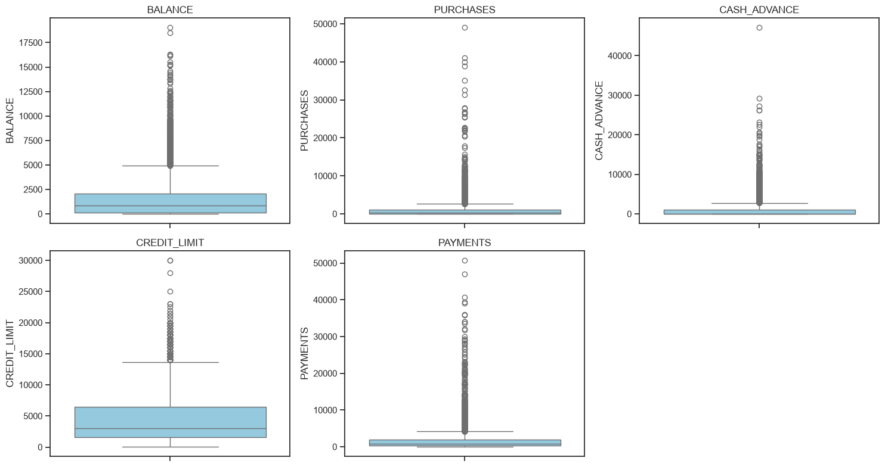<p align="center"><em>Before winsorization</em></p></td>
<td width="50%">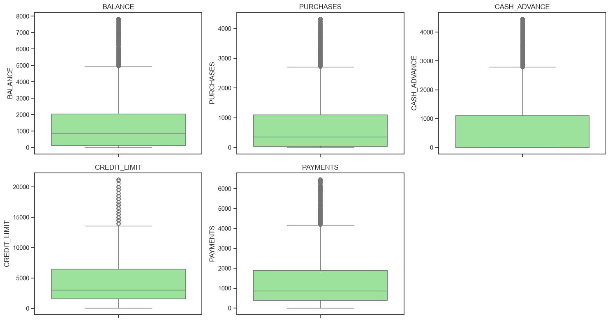<p align="center"><em>After winsorization (Q3 + 3×IQR)</em></p></td>
</tr>
</table>

Values were **winsorized** (capped, never dropped) at `Q3 + 3×IQR`, then **log1p-transformed** to symmetrize distributions:

<table>
<tr>
<td width="50%">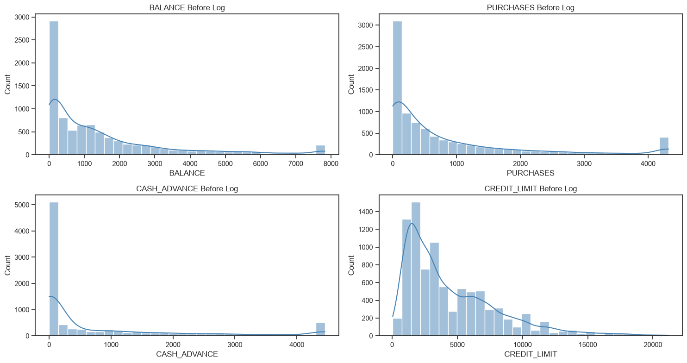<p align="center"><em>Before log1p transform</em></p></td>
<td width="50%">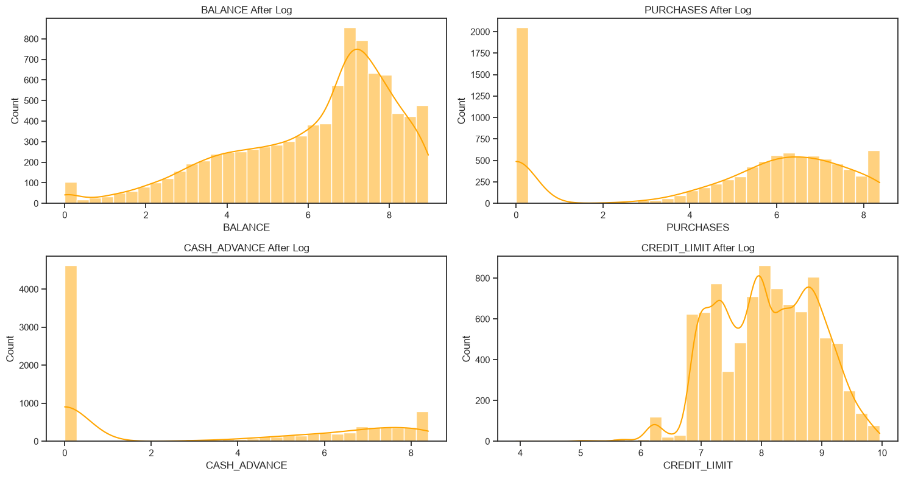<p align="center"><em>After log1p transform</em></p></td>
</tr>
</table>

Finally, all engineered + transformed features were standardized with `StandardScaler` so high-variance features (like `CASH_ADVANCE`) wouldn't dominate distance-based clustering. **PCA** (95% variance retained) reduced 22 features → 15 components for exploratory checks.

---

## 🔍 Exploratory Data Analysis

<p align="center">
  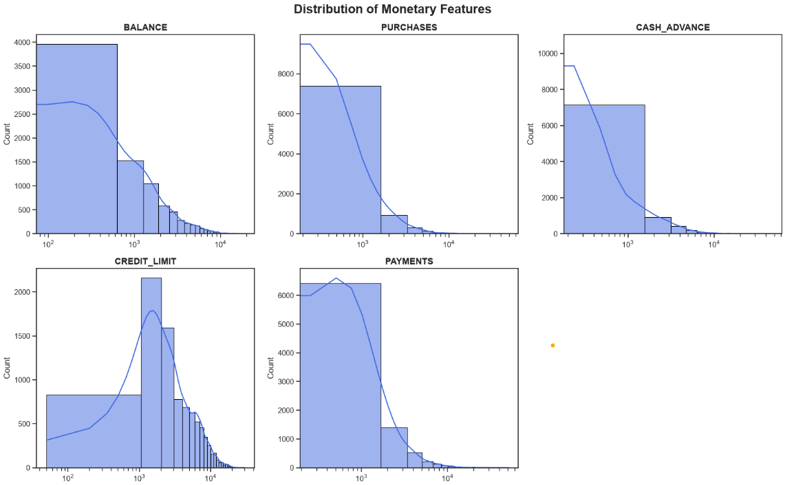
</p>
<p align="center"><em>Distribution of key monetary features on a log scale — confirming heavy right-skew</em></p>

---

## 🔵 K-Means Clustering

Optimal `k` was selected using both the **Elbow Method** and **Silhouette Score**:

<table>
<tr>
<td width="50%">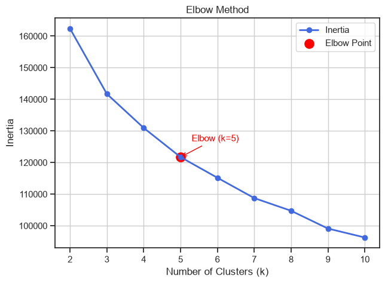<p align="center"><em>Elbow at k = 5</em></p></td>
<td width="50%">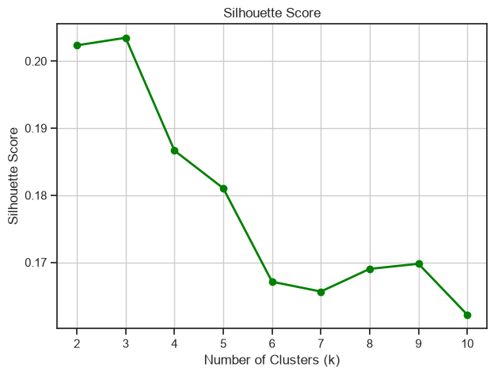<p align="center"><em>Silhouette Score across k values</em></p></td>
</tr>
</table>

<p align="center">
  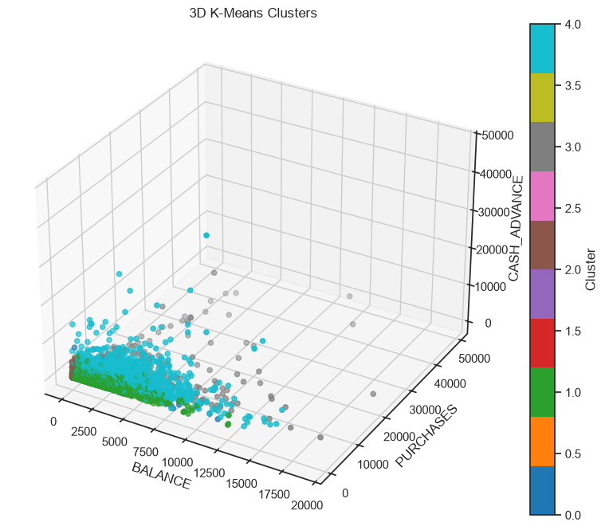
</p>
<p align="center"><em>3D view — BALANCE × PURCHASES × CASH_ADVANCE, coloured by K-Means cluster</em></p>

✅ **Final model:** `KMeans(n_clusters=5, init='k-means++', n_init=20, max_iter=500, random_state=42)`

---

## 🌳 Agglomerative Hierarchical Clustering

<p align="center">
  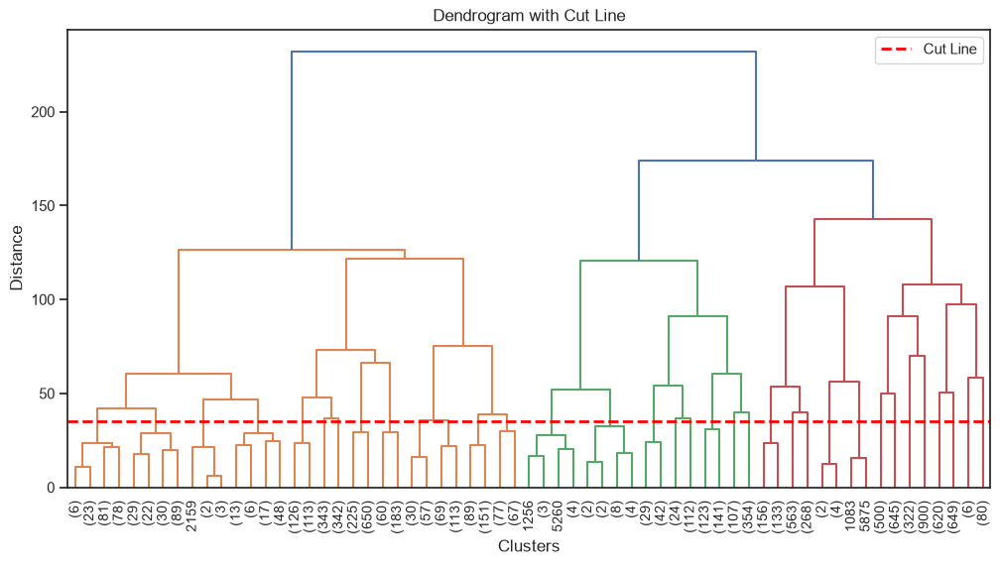
</p>
<p align="center"><em>Ward-linkage dendrogram with the chosen cut line</em></p>

Ward, Complete, and Average linkage were all compared. **Average linkage** scored highest on raw Silhouette (0.76) but produced one giant "chained" cluster of nearly all customers — a classic silhouette-inflation trap.

---

## 🔴 DBSCAN Clustering

<table>
<tr>
<td width="50%">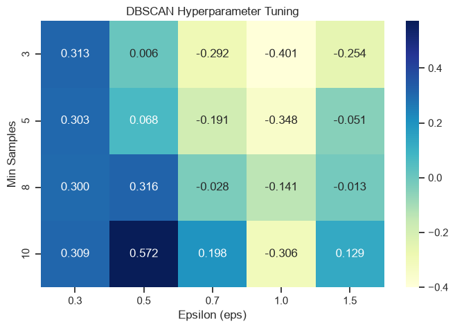<p align="center"><em>ε / min_samples tuning grid</em></p></td>
<td width="50%">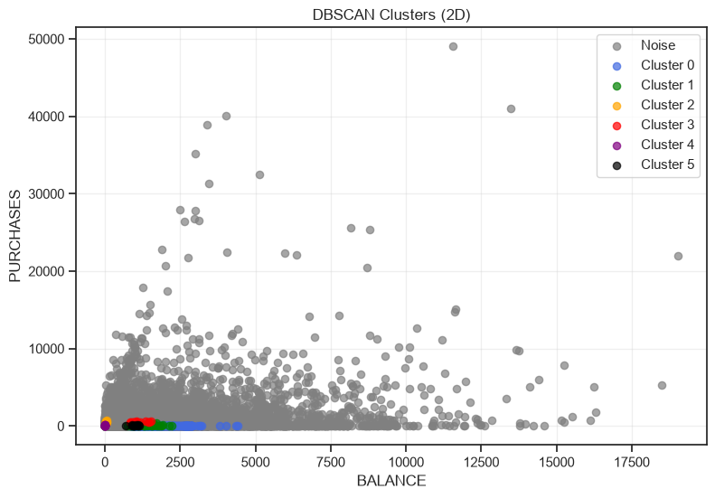<p align="center"><em>Resulting clusters (grey = noise)</em></p></td>
</tr>
</table>

DBSCAN flagged **~95% of customers as noise**, leaving only ~430 points across six tiny clusters — informative for outlier-hunting, but too sparse for segment-wide business action.

---

## 📈 Algorithm Comparison

| Algorithm | Silhouette Score | Verdict |
|---|:---:|---|
| Agglomerative (Average linkage) | **0.76** | ⚠️ Inflated — one giant chained cluster |
| DBSCAN | 0.57 | ⚠️ 95% of customers labeled noise |
| **K-Means (k=5)** | 0.18 | ✅ **Selected** — 5 well-populated, interpretable, stable segments |

> 💡 **Why K-Means won despite the lowest score:** Silhouette Score alone is misleading without checking cluster **size distribution**. K-Means was also the most **stable** across 5 random seeds — mean silhouette **0.1805 ± 0.0004**.

---

## 🧑‍💼 Cardholder Segments

| # | Persona | Size | Profile | Suggested Action |
|---|---|---:|---|---|
| 0 | 🟦 **Regular Customers** | ~3,294 | Moderate balances & purchases, typical repayment | Standard rewards program |
| 1 | 🟩 **Low Usage Customers** | ~2,596 | Low purchases, low balance, low utilization | Engagement / activation nudges |
| 2 | ⬛ **Dormant Cardholders** | ~1,485 | Minimal transaction activity | Reactivation offer + waived annual fee |
| 3 | 🟨 **Premium Spenders** | ~547 | High purchases, high balance, high credit limit | Balance-transfer / EMI conversion, premium rewards |
| 4 | 🟥 **Cash Advance Users** | ~1,028 | Heavy cash-advance reliance | Enhanced credit-risk & fraud monitoring |

---

## 📁 Project Structure

```
creditcard-segmentation-unsupervised-learning/
│
├── CreditCardSegmentation_UnsupervisedLearning.ipynb   # Fully executed notebook
├── CC_GENERAL.csv                                      # Raw dataset
├── cc_scaler.pkl                                       # Saved StandardScaler
├── cc_segmentation_model.pkl                           # Saved K-Means model
├── summary_report.md                                   # 1-page business summary
├── requirements.txt                                    # Dependencies
├── README.md                                           # You are here 📍
└── images/                                             # Charts used in this README
    ├── histograms.png
    ├── histograms_after_transformation.png
    ├── boxplots.png
    ├── boxplots_outliers.png
    ├── Distribution_of_Monetary_Features.png
    ├── Elbow_Method.png
    ├── Silhouette_Score.png
    ├── 3D_K-Means_Clusters.png
    ├── Dendrogram_with_Cut_Line.png
    ├── DBSCAN_Clusters.png
    └── DBSCAN_Hyperparameter_Tuning.png
```

---

## 🚀 Getting Started

```bash
# 1. Clone the repository
git clone https://github.com/<your-username>/creditcard-segmentation-unsupervised-learning.git
cd creditcard-segmentation-unsupervised-learning

# 2. Install dependencies
pip install -r requirements.txt

# 3. Launch the notebook
jupyter notebook CreditCardSegmentation_UnsupervisedLearning.ipynb
```

### 🔮 Using the saved pipeline

```python
import joblib

scaler = joblib.load("cc_scaler.pkl")
model  = joblib.load("cc_segmentation_model.pkl")

# scale new cardholder data, then predict
segment = model.predict(scaler.transform(new_customer_features))
```

---

## 🛠️ Tech Stack

`Python` · `Pandas` · `NumPy` · `scikit-learn` · `SciPy` · `Matplotlib` · `Seaborn` · `Plotly` · `Joblib`

---

## 🔭 Next Steps

- ➕ Incorporate demographic & transaction-channel data (age, income, merchant category)
- 🎯 Explore semi-supervised refinement by seeding clusters with known high-value/high-risk accounts
- ⚡ Productionize `cc_scaler.pkl` + `cc_segmentation_model.pkl` behind a real-time scoring API

---

## 👤 Author

**Krisha**
📎 [GitHub](https://github.com/krisha12345819) · [LinkedIn](https://www.linkedin.com/in/krisha-anghan-bb1179382/)

---

<div align="center">

📄 **Dataset:** [Credit Card Dataset for Clustering — Kaggle](https://www.kaggle.com/datasets/arjunbhasin2013/ccdata)

⭐ If you found this project useful, consider giving it a star!

</div>
